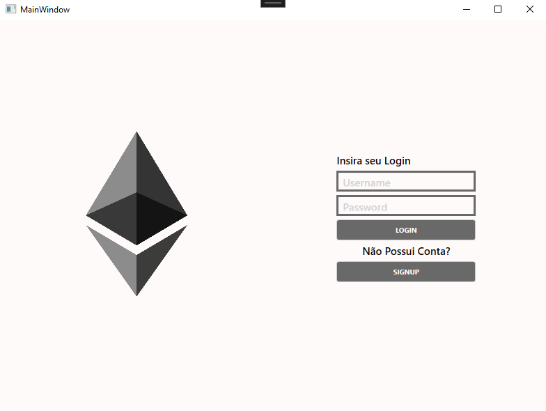

# Ethereum Access
## Al Paulo

### Motivação
A motivação da construção do app vem mediante a dificuldade de acessar informações na blockchain de maneira fácil.
Foi buscando suprir a necessidade de acessar e manipular essas informações que o app surgiu.

### Conceito
O projeto envolve a criação de um aplicativo que permitirá aos usuários visualizar saldos, realizar transações, gerenciar carteiras, explorar informações de blocos e interagir com contratos inteligentes na rede Ethereum.

### Função
A função principal do aplicativo é tornar a rede Ethereum mais acessível, simplificando a interação com ela por meio de uma interface gráfica amigável em C#.

### Diagrama de classes e relacionamentos

### Fluxograma

### Tutorial de Instalação

A linguagem visual utilizada foi o XAML.

1 - O aplicativo roda no Sistema Operacional Windows, o arquivo executável é encontrado na pasta "EthConsult\bin\Release\net6.0-windows" do projeto.

2 - Caso o executável não esteja disponível ele pode ser compilado utilizando a IDE Visual Studio utilizando as bibliotecas de desenvolvimento em .NET e C#. 

3 - Pode ser que na primeira utilização seja necessário instalar o .NET Framework, caso sim instale-o e execute o programa novamente.

### Tutorial de Utilização
Na primeira página o usuáro deve fazer o login caso já tenha um ou selecionar a opção de criar uma nova conta.
O login só será aceito caso haja um cadastro válido na base de dados.

Para criar uma nova conta o usuário deve preencher as informações necessárias para a criação da conta.

Na tela do usuário temos a opção de adicionar mais uma wallet ou de transferir saldo entre contas (já cadastradas ou não).
Nessa tela também temos a disposição a quantidade total de Ethereum por wallet e também algumas informações relevantes sobre a moeda (ETH/USD e Gas Fee estimado).

Para adicionar mais uma wallet basta preencher o popup que surge ao clicar no botão de "Adicionar Wallet".
Após adicionado ele irá para a lista de wallets do usuário.

Para transferir saldo entre contas basta selecionar uma das wallets já cadastradas de onde sairá o dinheiro e para onde ele irá (pode ser cadastrada ou não).
Caso não haja erros na transação será mostrada uma tela de sucesso para o usuário.

Link do repositório do projeto no GitHub: https://github.com/ProgramacaoAplicada2023/Paulo_EthAccess
